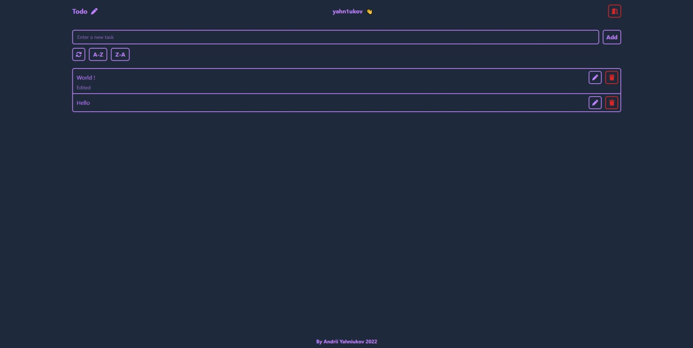

# 📃 Technologies

## Technologies

- [HTML](https://developer.mozilla.org/en-US/docs/Web/HTML)
- [Tailwind CSS](https://tailwindcss.com/)
- [TypeScript](https://www.typescriptlang.org/docs/)
- [React](https://reactjs.org/docs/getting-started.html)
  - Context;
  - Custom react-hooks;
  - react-router-dom.
- [Formik](https://formik.org/docs/overview)
  - [Yup](https://formik.org/docs/guides/validation)
- [Redux](https://redux.js.org/usage/)
  - [Redux Thunk](https://redux.js.org/usage/writing-logic-thunks)
  - [Redux Toolkit](https://redux.js.org/introduction/installation#redux-toolkit)

## Screenshots

